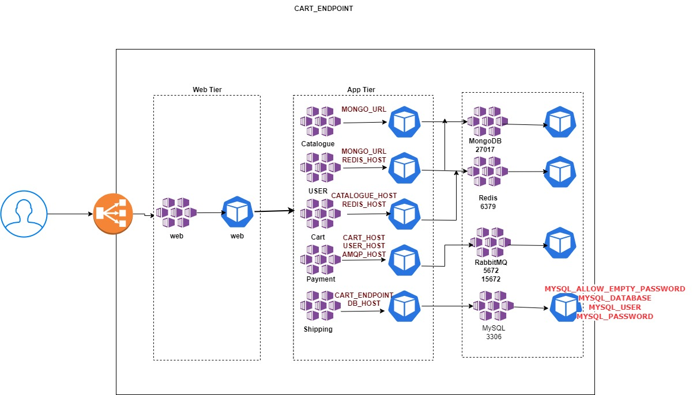

### Roboshop using Pod, ConfigMaps, Secrets

This project is configure RoboShop using Pods, ConfigMaps, Secrets. These are the basic building blocks of kuberntes.

#### Pre-requisites
* Watch the below diagram to understand the dependency.
* We are maintaining ConfigMap and Secret separately.
* Don't change the default ports of DB tier with the service attachment.
* Nginx config in web project is important.

